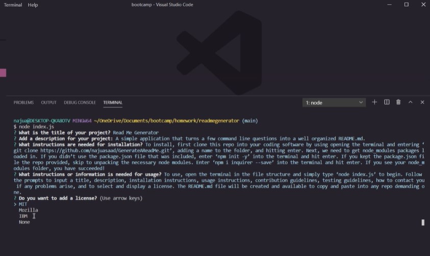

# Read Me Generator

## Description 
A simple application that turns a few command line questions into a well organized README.md.

## Table of Contents  
 
  [Installation](#Installation)  
 
  [Usage](#Usage) 
 
  [Contribute](#Contribute) 
 
  [Tests](#Tests) 
 
  [Problems](#Problems)  
 

## Installation
To install, first clone this repo into your coding software by using opening the terminal and entering ‘git clone https://github.com/najuasaad/GenerateAReadMe.git’, adding a name to the folder, and hitting enter. Next, we need to get node_modules packages loaded in. If you didn’t use the package.json file that was included, enter ‘npm init -y’ into the terminal and hit enter. If you kept the package.json file the repo provided, skip to unpacking the necessary node modules. Enter ‘npm i inquirer --save’ into the terminal and hit enter. If you see your node_modules folder, you have succeeded! 

## Usage 
To use, open the terminal in the file structure and simply type ‘node index.js’ to begin. Follow the prompts to input a title, description, installation instructions, usage instructions, contribution guidelines, testing guidelines, how to contact you if any problems arise, and to select and display a license. The README.md file will be created and available to copy and paste into any repo demanding one.

## Contribute 
In lieu of contributing, I encourage anyone to clone this repo and add onto it themselves to publish.

## Tests 
When testing this application, be sure to delete, rename, or relocate the files to make sure you’re getting the most up to date previews without overloading VSCode. 

## Problems
Contact via e-mail: najuasaad@gmail.com 

Or visit www.github.com/najuasaad

## Links

[Github Repo](https://github.com/najuasaad/GenerateAReadMe)

[Github Live Page](https://najuasaad.github.io/GenerateAReadMe/)

 